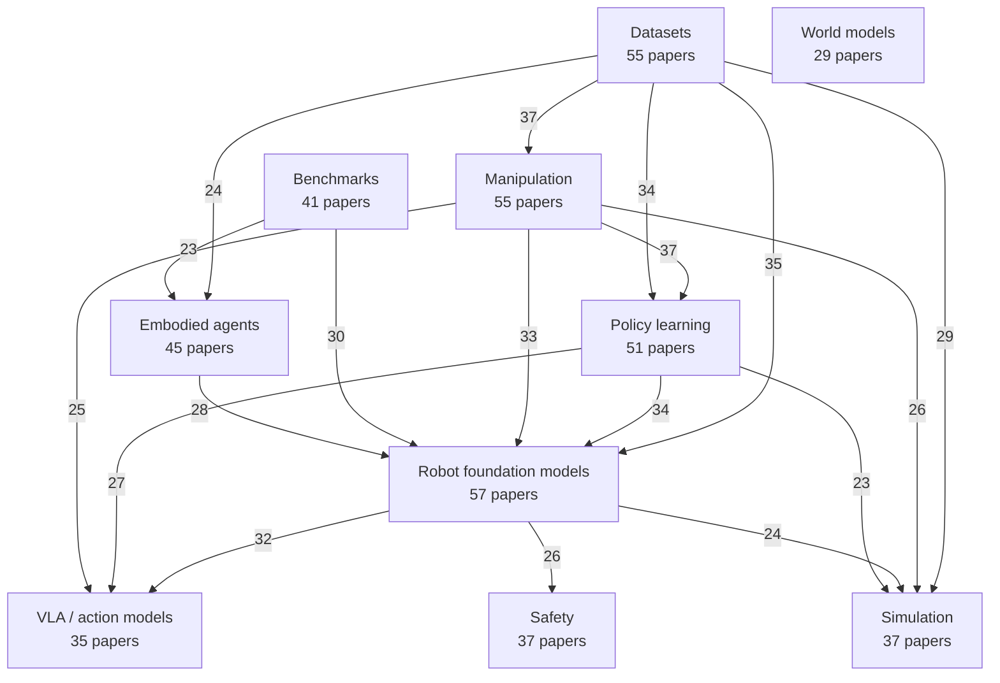

# Awesome Embodied Intelligence

> A daily updated awesome list for embodied intelligence, collecting papers,
> benchmarks, datasets, simulators, models, and tools for agents that perceive,
> reason, learn, and act through physical or simulated bodies.

Website: <https://evanlyu732.github.io/cursor/>

Embodied intelligence spans robot learning, embodied AI, manipulation, locomotion,
navigation, simulation, vision-language-action models, and world models for
interactive agents that connect perception to action.

## Contents

| Hot | Latest | Core |
| --- | --- | --- |
| [Idea graph](#paper-idea-graph) | [Hot picks](#hottest-papers) | [Recent papers](#recent-papers) |
| [Surveys](#surveys-and-reading-lists) | [Benchmarks](#benchmarks-and-environments) | [Models](#foundation-models-for-action) |
| [Robot learning](#robot-learning) | [Manipulation](#manipulation) | [Navigation](#navigation-and-embodied-ai) |
| [Locomotion](#locomotion) | [Simulation](#simulation-and-digital-twins) | [Datasets](#datasets) |
| [Tools](#tooling) |  |  |

## Paper Idea Graph

This section extracts core ideas from recent paper titles and arXiv summaries,
then connects ideas that appear together in the same papers.

<!-- BEGIN AUTO-GENERATED: idea-graph -->
Last updated: 2026-06-26 UTC
Built from papers published from 2026-06-17 through 2026-06-26.

| Idea | Papers |
| --- | --- |
| Robot foundation models | 57 |
| Datasets | 55 |
| Manipulation | 55 |
| Policy learning | 51 |
| Embodied agents | 45 |
| Benchmarks | 41 |
| Simulation | 37 |
| Safety | 37 |
| VLA / action models | 35 |
| World models | 29 |
<!-- END AUTO-GENERATED: idea-graph -->

## Hottest Papers

This section highlights the best recent picks from the 10-day paper window.
It is updated automatically using a transparent heuristic based on recency and
embodied-intelligence signals such as VLA, robot foundation models,
manipulation, benchmarks, datasets, safety, and world models. Link shortcuts
search for author sites, X discussion, and Reddit discussion.

<!-- BEGIN AUTO-GENERATED: hottest-papers -->
Last updated: 2026-06-26 UTC
Selected from papers published from 2026-06-17 through 2026-06-26.

| Paper | Summary | Why it is hot | Links | Published |
| --- | --- | --- | --- | --- |
| [ForesightSafety-VLA: A Unified Diagnostic Safety Benchmark for Vision-Language-Action Models](https://arxiv.org/abs/2606.27079) | In embodied intelligence, safety is a prerequisite for reliable robot deployment in the physical world. | Vision-language-action, Robot foundation models, Benchmarks and datasets | [author site](https://duckduckgo.com/?q=Mingyang+Lyu+ForesightSafety-VLA%3A+A+Unified+Diagnostic+Safety+Benchmark+for+Vision-Language-Action+Models+homepage) · [X](https://x.com/search?q=%22ForesightSafety-VLA%3A+A+Unified+Diagnostic+Safety+Benchmark+for+Vision-Language-Action+Models%22) · [reddit](https://www.reddit.com/search/?q=%22ForesightSafety-VLA%3A+A+Unified+Diagnostic+Safety+Benchmark+for+Vision-Language-Action+Models%22) | 2026-06-25 |
| [LIBERO-Safety: A Comprehensive Benchmark for Physical and Semantic Safety in Vision-Language-Action Models](https://arxiv.org/abs/2606.23686) | Despite the impressive manipulation capabilities of Vision-Language-Action (VLA) models, their operational safety under strict constraints remains largely unverified. | Vision-language-action, Robot foundation models, Manipulation | [author site](https://duckduckgo.com/?q=Rongxu+Cui+LIBERO-Safety%3A+A+Comprehensive+Benchmark+for+Physical+and+Semantic+Safety+in+Vision-Language-Action+Models+homepage) · [X](https://x.com/search?q=%22LIBERO-Safety%3A+A+Comprehensive+Benchmark+for+Physical+and+Semantic+Safety+in+Vision-Language-Action+Models%22) · [reddit](https://www.reddit.com/search/?q=%22LIBERO-Safety%3A+A+Comprehensive+Benchmark+for+Physical+and+Semantic+Safety+in+Vision-Language-Action+Models%22) | 2026-06-22 |
| [dVLA-RL: Reinforcement Learning over Denoising Trajectories for Discrete Diffusion Vision-Language-Action Models](https://arxiv.org/abs/2606.23623) | Vision-Language-Action (VLA) models have established a powerful paradigm for generalist robotic manipulation by grounding control into the semantic reasoning of VLMs. | Vision-language-action, Robot foundation models, Robot learning | [author site](https://duckduckgo.com/?q=Yuhao+Wu+dVLA-RL%3A+Reinforcement+Learning+over+Denoising+Trajectories+for+Discrete+Diffusion+Vision-Language-Action+Models+homepage) · [X](https://x.com/search?q=%22dVLA-RL%3A+Reinforcement+Learning+over+Denoising+Trajectories+for+Discrete+Diffusion+Vision-Language-Action+Models%22) · [reddit](https://www.reddit.com/search/?q=%22dVLA-RL%3A+Reinforcement+Learning+over+Denoising+Trajectories+for+Discrete+Diffusion+Vision-Language-Action+Models%22) | 2026-06-22 |
| [WOLF-VLA: Whole-Body Humanoid Optimal Locomotion Framework for Vision-Language-Action Learning](https://arxiv.org/abs/2606.25591) | Vision-Language-Action (VLA) models have recently demonstrated strong generalization in robotic manipulation, yet their applicability to whole-body, contact-rich humanoid locomotion remains severely underexplored due... | Vision-language-action, Robot foundation models, Manipulation | [author site](https://duckduckgo.com/?q=Melya+Boukheddimi+WOLF-VLA%3A+Whole-Body+Humanoid+Optimal+Locomotion+Framework+for+Vision-Language-Action+Learning+homepage) · [X](https://x.com/search?q=%22WOLF-VLA%3A+Whole-Body+Humanoid+Optimal+Locomotion+Framework+for+Vision-Language-Action+Learning%22) · [reddit](https://www.reddit.com/search/?q=%22WOLF-VLA%3A+Whole-Body+Humanoid+Optimal+Locomotion+Framework+for+Vision-Language-Action+Learning%22) | 2026-06-24 |
| [IOI: Decoupling Kinematics and Physics for Interactive World Models](https://arxiv.org/abs/2606.23296) | Developing generalist embodied agents requires interactive environments providing visually realistic feedback and accurate action-conditioned dynamics. | Robot foundation models, Robot learning, Benchmarks and datasets | [author site](https://duckduckgo.com/?q=Chengyu+Bai+IOI%3A+Decoupling+Kinematics+and+Physics+for+Interactive+World+Models+homepage) · [X](https://x.com/search?q=%22IOI%3A+Decoupling+Kinematics+and+Physics+for+Interactive+World+Models%22) · [reddit](https://www.reddit.com/search/?q=%22IOI%3A+Decoupling+Kinematics+and+Physics+for+Interactive+World+Models%22) | 2026-06-22 |
<!-- END AUTO-GENERATED: hottest-papers -->

## Recent Papers

This section is updated automatically every day at 08:00 UTC by
[`scripts/update_recent.py`](scripts/update_recent.py). The updater fetches
recent arXiv entries related to embodied intelligence, robot learning,
embodied AI, and vision-language-action systems, keeping papers published in
the last 10 days. Link shortcuts search for author sites, X discussion, and
Reddit discussion.

<!-- BEGIN AUTO-GENERATED: recent-papers -->
Last updated: 2026-06-26 UTC
Showing papers published from 2026-06-17 through 2026-06-26.

| Paper | Summary | Authors | Links | Published |
| --- | --- | --- | --- | --- |
| [World Action Models Enable Continual Imitation Learning with Recurrent Generative Replays](https://arxiv.org/abs/2606.27374) | Going beyond predicting robot actions, World Action Models (WAMs) can also generate future visual observations. | Manish Kumar Govind, Dominick Reilly, Smit Patel, Hieu Le, Srijan Das | [author site](https://duckduckgo.com/?q=Manish+Kumar+Govind+World+Action+Models+Enable+Continual+Imitation+Learning+with+Recurrent+Generative+Replays+homepage) · [X](https://x.com/search?q=%22World+Action+Models+Enable+Continual+Imitation+Learning+with+Recurrent+Generative+Replays%22) · [reddit](https://www.reddit.com/search/?q=%22World+Action+Models+Enable+Continual+Imitation+Learning+with+Recurrent+Generative+Replays%22) | 2026-06-25 |
| [SSI-Policy: Learning Structured Scene Interfaces for Vision-Language Robotic Manipulation](https://arxiv.org/abs/2606.26800) | Real-world robotic manipulation demands spatial grounding, task-aware reasoning, and precise control. | Kaijun Wang, Zikai Ouyang, Xuping Wu, Jinyi Hong, Wei Pan, Haibo Lu, et al. (+3) | [author site](https://duckduckgo.com/?q=Kaijun+Wang+SSI-Policy%3A+Learning+Structured+Scene+Interfaces+for+Vision-Language+Robotic+Manipulation+homepage) · [X](https://x.com/search?q=%22SSI-Policy%3A+Learning+Structured+Scene+Interfaces+for+Vision-Language+Robotic+Manipulation%22) · [reddit](https://www.reddit.com/search/?q=%22SSI-Policy%3A+Learning+Structured+Scene+Interfaces+for+Vision-Language+Robotic+Manipulation%22) | 2026-06-25 |
| [Scalable Behavior Cloning with Open Data, Training, and Evaluation](https://arxiv.org/abs/2606.27375) | We introduce ABC, a fully open-source stack for manipulation with behavior cloning. | Arthur Allshire, Himanshu Gaurav Singh, Ritvik Singh, Adam Rashid, Hongsuk Choi, David McAllister, et al. (+12) | [author site](https://duckduckgo.com/?q=Arthur+Allshire+Scalable+Behavior+Cloning+with+Open+Data%2C+Training%2C+and+Evaluation+homepage) · [X](https://x.com/search?q=%22Scalable+Behavior+Cloning+with+Open+Data%2C+Training%2C+and+Evaluation%22) · [reddit](https://www.reddit.com/search/?q=%22Scalable+Behavior+Cloning+with+Open+Data%2C+Training%2C+and+Evaluation%22) | 2026-06-25 |
| [RouterVLA: Turning Smoke Tests into Supervision for Heterogeneous VLA Selection](https://arxiv.org/abs/2606.27355) | We study whether pre-deployment evaluation rollouts can be reused to supervise policy selection. | Xingyu Ren, Chugang Yi, Ge Ma, Youran Sun | [author site](https://duckduckgo.com/?q=Xingyu+Ren+RouterVLA%3A+Turning+Smoke+Tests+into+Supervision+for+Heterogeneous+VLA+Selection+homepage) · [X](https://x.com/search?q=%22RouterVLA%3A+Turning+Smoke+Tests+into+Supervision+for+Heterogeneous+VLA+Selection%22) · [reddit](https://www.reddit.com/search/?q=%22RouterVLA%3A+Turning+Smoke+Tests+into+Supervision+for+Heterogeneous+VLA+Selection%22) | 2026-06-25 |
| [RelAfford6D: Relational 6D Affordance Graphs for Constraint-Driven Robotic Manipulation](https://arxiv.org/abs/2606.27036) | Bridging abstract semantics and precise physical control remains a fundamental challenge in open-world robotic manipulation. | Guodong Zhang, Qichen He, Wenyuan Xie, Shaokai Wu, Yanbiao Ji, Qiuchang Li, et al. (+3) | [author site](https://duckduckgo.com/?q=Guodong+Zhang+RelAfford6D%3A+Relational+6D+Affordance+Graphs+for+Constraint-Driven+Robotic+Manipulation+homepage) · [X](https://x.com/search?q=%22RelAfford6D%3A+Relational+6D+Affordance+Graphs+for+Constraint-Driven+Robotic+Manipulation%22) · [reddit](https://www.reddit.com/search/?q=%22RelAfford6D%3A+Relational+6D+Affordance+Graphs+for+Constraint-Driven+Robotic+Manipulation%22) | 2026-06-25 |
| [PhysReflect-VLA: Physical Feasibility and Self-Reflective Regulation for Reliable Vision-Language-Action Policies](https://arxiv.org/abs/2606.27146) | Long-horizon robotic manipulation is highly sensitive to physically infeasible transitions, contact-induced disturbances, and the lack of effective self-correction during execution. | Jiayu Yang, Tao Yang, Weijun Li, Xiang Chang, Fei Chao, Changjing Shang, et al. (+1) | [author site](https://duckduckgo.com/?q=Jiayu+Yang+PhysReflect-VLA%3A+Physical+Feasibility+and+Self-Reflective+Regulation+for+Reliable+Vision-Language-Action+Policies+homepage) · [X](https://x.com/search?q=%22PhysReflect-VLA%3A+Physical+Feasibility+and+Self-Reflective+Regulation+for+Reliable+Vision-Language-Action+Policies%22) · [reddit](https://www.reddit.com/search/?q=%22PhysReflect-VLA%3A+Physical+Feasibility+and+Self-Reflective+Regulation+for+Reliable+Vision-Language-Action+Policies%22) | 2026-06-25 |
| [PAMAE: Phase-Aware-MoE Action Experts Towards Reliable Flow-Matching Vision-Language-Action Policies](https://arxiv.org/abs/2606.27144) | Reliable action generation for multi-stage robotic manipulation remains challenging for Vision-Language-Action (VLA) models. | Jiayu Yang, Tao Yang, Xiang Chang, Fei Chao, Changjing Shang, Qiang Shen | [author site](https://duckduckgo.com/?q=Jiayu+Yang+PAMAE%3A+Phase-Aware-MoE+Action+Experts+Towards+Reliable+Flow-Matching+Vision-Language-Action+Policies+homepage) · [X](https://x.com/search?q=%22PAMAE%3A+Phase-Aware-MoE+Action+Experts+Towards+Reliable+Flow-Matching+Vision-Language-Action+Policies%22) · [reddit](https://www.reddit.com/search/?q=%22PAMAE%3A+Phase-Aware-MoE+Action+Experts+Towards+Reliable+Flow-Matching+Vision-Language-Action+Policies%22) | 2026-06-25 |
| [Look-Before-Move: Narrative-Grounded World Visual Attention in Dynamic 3D Story Worlds](https://arxiv.org/abs/2606.26964) | As embodied AI and world models increasingly operate in dynamic 3D environments, visual perception must move beyond passively interpreting given observations toward actively deciding what to observe. | Jiaming Bian, Bingliang Li, Yuehao Wu, Pichao Wang, Zhi Wang, Hailan Ma, et al. (+2) | [author site](https://duckduckgo.com/?q=Jiaming+Bian+Look-Before-Move%3A+Narrative-Grounded+World+Visual+Attention+in+Dynamic+3D+Story+Worlds+homepage) · [X](https://x.com/search?q=%22Look-Before-Move%3A+Narrative-Grounded+World+Visual+Attention+in+Dynamic+3D+Story+Worlds%22) · [reddit](https://www.reddit.com/search/?q=%22Look-Before-Move%3A+Narrative-Grounded+World+Visual+Attention+in+Dynamic+3D+Story+Worlds%22) | 2026-06-25 |
| [Learning to Fold: prizewinning solution at LeHome Challenge 2026 (1st place online, 2nd offline)](https://arxiv.org/abs/2606.27163) | I describe my solution to the LeHome Challenge 2026, an ICRA 2026 competition on bimanual garment folding. | Ilia Larchenko | [author site](https://duckduckgo.com/?q=Ilia+Larchenko+Learning+to+Fold%3A+prizewinning+solution+at+LeHome+Challenge+2026+%281st+place+online%2C+2nd+offline%29+homepage) · [X](https://x.com/search?q=%22Learning+to+Fold%3A+prizewinning+solution+at+LeHome+Challenge+2026+%281st+place+online%2C+2nd+offline%29%22) · [reddit](https://www.reddit.com/search/?q=%22Learning+to+Fold%3A+prizewinning+solution+at+LeHome+Challenge+2026+%281st+place+online%2C+2nd+offline%29%22) | 2026-06-25 |
| [LA4VLA: Learning to Act without Seeing via Language-Action Pretraining](https://arxiv.org/abs/2606.27295) | Vision-Language-Action (VLA) models are commonly pretrained on robot demonstrations by jointly mapping visual observations and language instructions to actions. | Tao Lin, Yuxin Du, Yiran Mao, Zewei Ye, Yilei Zhong, Bing Cheng, et al. (+10) | [author site](https://duckduckgo.com/?q=Tao+Lin+LA4VLA%3A+Learning+to+Act+without+Seeing+via+Language-Action+Pretraining+homepage) · [X](https://x.com/search?q=%22LA4VLA%3A+Learning+to+Act+without+Seeing+via+Language-Action+Pretraining%22) · [reddit](https://www.reddit.com/search/?q=%22LA4VLA%3A+Learning+to+Act+without+Seeing+via+Language-Action+Pretraining%22) | 2026-06-25 |
| [Improving Vision-Language-Action Model Fine-Tuning with Structured Stage and Keyframe Supervision](https://arxiv.org/abs/2606.26801) | Vision-Language-Action (VLA) models have shown strong potential for generalizable robotic manipulation. | Yuan Xu, Yixiang Chen, Kai Wang, Jiabing Yang, Peiyan Li, Qisen Ma, et al. (+2) | [author site](https://duckduckgo.com/?q=Yuan+Xu+Improving+Vision-Language-Action+Model+Fine-Tuning+with+Structured+Stage+and+Keyframe+Supervision+homepage) · [X](https://x.com/search?q=%22Improving+Vision-Language-Action+Model+Fine-Tuning+with+Structured+Stage+and+Keyframe+Supervision%22) · [reddit](https://www.reddit.com/search/?q=%22Improving+Vision-Language-Action+Model+Fine-Tuning+with+Structured+Stage+and+Keyframe+Supervision%22) | 2026-06-25 |
| [ForesightSafety-VLA: A Unified Diagnostic Safety Benchmark for Vision-Language-Action Models](https://arxiv.org/abs/2606.27079) | In embodied intelligence, safety is a prerequisite for reliable robot deployment in the physical world. | Mingyang Lyu, Yinqian Sun, Yiyang Jia, Sicheng Shen, Moquan Sha, Huangrui Li, et al. (+2) | [author site](https://duckduckgo.com/?q=Mingyang+Lyu+ForesightSafety-VLA%3A+A+Unified+Diagnostic+Safety+Benchmark+for+Vision-Language-Action+Models+homepage) · [X](https://x.com/search?q=%22ForesightSafety-VLA%3A+A+Unified+Diagnostic+Safety+Benchmark+for+Vision-Language-Action+Models%22) · [reddit](https://www.reddit.com/search/?q=%22ForesightSafety-VLA%3A+A+Unified+Diagnostic+Safety+Benchmark+for+Vision-Language-Action+Models%22) | 2026-06-25 |
| [E-TTS: A New Embodied Test-Time Scaling Framework for Robotic Manipulation](https://arxiv.org/abs/2606.27268) | Recently, a few works have made early attempts to study test-time scaling for embodied tasks. | Wen Ye, Peiyan Li, Tingyu Yuan, Yuan Xu, Xiangnan Wu, Chaoyang Zhao, et al. (+4) | [author site](https://duckduckgo.com/?q=Wen+Ye+E-TTS%3A+A+New+Embodied+Test-Time+Scaling+Framework+for+Robotic+Manipulation+homepage) · [X](https://x.com/search?q=%22E-TTS%3A+A+New+Embodied+Test-Time+Scaling+Framework+for+Robotic+Manipulation%22) · [reddit](https://www.reddit.com/search/?q=%22E-TTS%3A+A+New+Embodied+Test-Time+Scaling+Framework+for+Robotic+Manipulation%22) | 2026-06-25 |
| [Advancing Omnimodal Embodied Agents from Isolated Skills to Everyday Physical Autonomy](https://arxiv.org/abs/2606.27251) | Building persistent embodied agents in unstructured environments demands unified orchestration of heterogeneous tools spanning both cyber (APIs, IoT) and physical (manipulation, navigation) domains, coupled with... | Junhao Shi, Zezheng Huai, Siyin Wang, Jia Chen, Yubang Wang, Zhaoye Fei, et al. (+4) | [author site](https://duckduckgo.com/?q=Junhao+Shi+Advancing+Omnimodal+Embodied+Agents+from+Isolated+Skills+to+Everyday+Physical+Autonomy+homepage) · [X](https://x.com/search?q=%22Advancing+Omnimodal+Embodied+Agents+from+Isolated+Skills+to+Everyday+Physical+Autonomy%22) · [reddit](https://www.reddit.com/search/?q=%22Advancing+Omnimodal+Embodied+Agents+from+Isolated+Skills+to+Everyday+Physical+Autonomy%22) | 2026-06-25 |
| [WOLF-VLA: Whole-Body Humanoid Optimal Locomotion Framework for Vision-Language-Action Learning](https://arxiv.org/abs/2606.25591) | Vision-Language-Action (VLA) models have recently demonstrated strong generalization in robotic manipulation, yet their applicability to whole-body, contact-rich humanoid locomotion remains severely underexplored due... | Melya Boukheddimi, Omar Adjali, Daniel Sontag, Frank Kirchner | [author site](https://duckduckgo.com/?q=Melya+Boukheddimi+WOLF-VLA%3A+Whole-Body+Humanoid+Optimal+Locomotion+Framework+for+Vision-Language-Action+Learning+homepage) · [X](https://x.com/search?q=%22WOLF-VLA%3A+Whole-Body+Humanoid+Optimal+Locomotion+Framework+for+Vision-Language-Action+Learning%22) · [reddit](https://www.reddit.com/search/?q=%22WOLF-VLA%3A+Whole-Body+Humanoid+Optimal+Locomotion+Framework+for+Vision-Language-Action+Learning%22) | 2026-06-24 |
| [WatchAct: A Benchmark for Behavior-Grounded Robot Manipulation](https://arxiv.org/abs/2606.26443) | A robot working alongside people must reason about what they have done, in what order, and with what intent. | Baiqi Li, Ce Zhang, Yu Fang, Yue Yang, Shangzhe Li, Mingyu Ding, et al. (+1) | [author site](https://duckduckgo.com/?q=Baiqi+Li+WatchAct%3A+A+Benchmark+for+Behavior-Grounded+Robot+Manipulation+homepage) · [X](https://x.com/search?q=%22WatchAct%3A+A+Benchmark+for+Behavior-Grounded+Robot+Manipulation%22) · [reddit](https://www.reddit.com/search/?q=%22WatchAct%3A+A+Benchmark+for+Behavior-Grounded+Robot+Manipulation%22) | 2026-06-24 |
| [SAGE-Nav: Leveraging LLM Planning and Alignment Fusion for Hierarchical Scene Graph-Guided Navigation](https://arxiv.org/abs/2606.25497) | Object-Goal Navigation (ObjNav) requires embodied agents to autonomously locate specified targets using only egocentric visual observations. | Hao Su, Yuehao Huang, Yukai Ma, Yong Liu, Jiajun Lv | [author site](https://duckduckgo.com/?q=Hao+Su+SAGE-Nav%3A+Leveraging+LLM+Planning+and+Alignment+Fusion+for+Hierarchical+Scene+Graph-Guided+Navigation+homepage) · [X](https://x.com/search?q=%22SAGE-Nav%3A+Leveraging+LLM+Planning+and+Alignment+Fusion+for+Hierarchical+Scene+Graph-Guided+Navigation%22) · [reddit](https://www.reddit.com/search/?q=%22SAGE-Nav%3A+Leveraging+LLM+Planning+and+Alignment+Fusion+for+Hierarchical+Scene+Graph-Guided+Navigation%22) | 2026-06-24 |
| [ROAD-VLA: Robust Online Adaptation via Self-Distillation for Vision-Language-Action Models](https://arxiv.org/abs/2606.25800) | Effective online adaptation of vision-language-action (VLA) models remains challenging, as sparse rewards provide weak supervision for high-dimensional autoregressive action policies. | Kejing Wang, Toan Nguyen, Minh Hoang Nguyen, Simon Khan, Flora D. Salim | [author site](https://duckduckgo.com/?q=Kejing+Wang+ROAD-VLA%3A+Robust+Online+Adaptation+via+Self-Distillation+for+Vision-Language-Action+Models+homepage) · [X](https://x.com/search?q=%22ROAD-VLA%3A+Robust+Online+Adaptation+via+Self-Distillation+for+Vision-Language-Action+Models%22) · [reddit](https://www.reddit.com/search/?q=%22ROAD-VLA%3A+Robust+Online+Adaptation+via+Self-Distillation+for+Vision-Language-Action+Models%22) | 2026-06-24 |
| [RMTL: Reinforced Micro-task Learning for Long-Horizon Manipulation with VLM Rewards](https://arxiv.org/abs/2606.26175) | Reinforcement learning (RL) for robotic manipulation often requires manually designing a dense reward function, which is difficult to tune and often fragile, or learning a reward from human demonstrations or... | Anıl Can Ateş, Orhan Kahraman, Cihan Topal | [author site](https://duckduckgo.com/?q=An%C4%B1l+Can+Ate%C5%9F+RMTL%3A+Reinforced+Micro-task+Learning+for+Long-Horizon+Manipulation+with+VLM+Rewards+homepage) · [X](https://x.com/search?q=%22RMTL%3A+Reinforced+Micro-task+Learning+for+Long-Horizon+Manipulation+with+VLM+Rewards%22) · [reddit](https://www.reddit.com/search/?q=%22RMTL%3A+Reinforced+Micro-task+Learning+for+Long-Horizon+Manipulation+with+VLM+Rewards%22) | 2026-06-24 |
| [NavIsaacLab: Generating Realistic Crowd via Parallel Robot Learning for Benchmarking Human-aware Navigation](https://arxiv.org/abs/2606.26265) | Robot autonomous navigation that accounts for surrounding human activities is crucial for ensuring both safety and natural human-robot interaction in real-world environments shared by humans and robots. | Bingyi Xia, Han Bao, Jingyu Zhu, Hanjing Ye, Yuhan Pang, Guangcheng Chen, et al. (+3) | [author site](https://duckduckgo.com/?q=Bingyi+Xia+NavIsaacLab%3A+Generating+Realistic+Crowd+via+Parallel+Robot+Learning+for+Benchmarking+Human-aware+Navigation+homepage) · [X](https://x.com/search?q=%22NavIsaacLab%3A+Generating+Realistic+Crowd+via+Parallel+Robot+Learning+for+Benchmarking+Human-aware+Navigation%22) · [reddit](https://www.reddit.com/search/?q=%22NavIsaacLab%3A+Generating+Realistic+Crowd+via+Parallel+Robot+Learning+for+Benchmarking+Human-aware+Navigation%22) | 2026-06-24 |
| [LiMoDE: Rethinking Lifelong Robot Manipulation from a Mixture-of-Dynamic-Experts Perspective](https://arxiv.org/abs/2606.26183) | Building a generalist robot that can leverage prior knowledge for continuous task adaptation remains a significant challenge. | Zhihao Gu, Lin Wang | [author site](https://duckduckgo.com/?q=Zhihao+Gu+LiMoDE%3A+Rethinking+Lifelong+Robot+Manipulation+from+a+Mixture-of-Dynamic-Experts+Perspective+homepage) · [X](https://x.com/search?q=%22LiMoDE%3A+Rethinking+Lifelong+Robot+Manipulation+from+a+Mixture-of-Dynamic-Experts+Perspective%22) · [reddit](https://www.reddit.com/search/?q=%22LiMoDE%3A+Rethinking+Lifelong+Robot+Manipulation+from+a+Mixture-of-Dynamic-Experts+Perspective%22) | 2026-06-24 |
| [Learning Action Priors for Cross-embodiment Robot Manipulation](https://arxiv.org/abs/2606.26095) | Most Vision-Language-Action (VLA) models build on a Vision-Language Model (VLM) backbone by attaching an action module and optimizing the full policy jointly. | Dong Jing, Tianqi Zhang, Jiaqi Liu, Jinman Zhao, Zelong Sun, Li Erran Li, et al. (+2) | [author site](https://duckduckgo.com/?q=Dong+Jing+Learning+Action+Priors+for+Cross-embodiment+Robot+Manipulation+homepage) · [X](https://x.com/search?q=%22Learning+Action+Priors+for+Cross-embodiment+Robot+Manipulation%22) · [reddit](https://www.reddit.com/search/?q=%22Learning+Action+Priors+for+Cross-embodiment+Robot+Manipulation%22) | 2026-06-24 |
| [In-Context World Modeling for Robotic Control](https://arxiv.org/abs/2606.26025) | Modern Vision-Language-Action (VLA) models often fail to generalize to novel setups, such as altered camera viewpoints or robot morphologies, because they are typically conditioned only on current observations and... | Siyin Wang, Junhao Shi, Senyu Fei, Zhaoyang Fu, Li Ji, Jingjing Gong, et al. (+1) | [author site](https://duckduckgo.com/?q=Siyin+Wang+In-Context+World+Modeling+for+Robotic+Control+homepage) · [X](https://x.com/search?q=%22In-Context+World+Modeling+for+Robotic+Control%22) · [reddit](https://www.reddit.com/search/?q=%22In-Context+World+Modeling+for+Robotic+Control%22) | 2026-06-24 |
| [ForceBand: Learning Forceful Manipulation with sEMG](https://arxiv.org/abs/2606.26093) | Human demonstrations are a scalable data source for learning robot manipulation policies. | Botao He, Zhi Wang, Linna Kuang, Ishaan Ghosh, Jitendra Malik, Cornelia Fermuller, et al. (+5) | [author site](https://duckduckgo.com/?q=Botao+He+ForceBand%3A+Learning+Forceful+Manipulation+with+sEMG+homepage) · [X](https://x.com/search?q=%22ForceBand%3A+Learning+Forceful+Manipulation+with+sEMG%22) · [reddit](https://www.reddit.com/search/?q=%22ForceBand%3A+Learning+Forceful+Manipulation+with+sEMG%22) | 2026-06-24 |
| [FORCE: Efficient VLA Reinforcement Fine-Tuning via Value-Calibrated Warm-up and Self-Distillation](https://arxiv.org/abs/2606.26006) | Vision-Language-Action (VLA) models are often constrained by the imitation ceiling imposed by sub-optimal data. | Shuyi Zhang, Yunfan Lou, Hongyang Cheng, Yichen Guo, Chuyao Fu, Yaoxu Lyu, et al. (+5) | [author site](https://duckduckgo.com/?q=Shuyi+Zhang+FORCE%3A+Efficient+VLA+Reinforcement+Fine-Tuning+via+Value-Calibrated+Warm-up+and+Self-Distillation+homepage) · [X](https://x.com/search?q=%22FORCE%3A+Efficient+VLA+Reinforcement+Fine-Tuning+via+Value-Calibrated+Warm-up+and+Self-Distillation%22) · [reddit](https://www.reddit.com/search/?q=%22FORCE%3A+Efficient+VLA+Reinforcement+Fine-Tuning+via+Value-Calibrated+Warm-up+and+Self-Distillation%22) | 2026-06-24 |
| [DSP-SLAM++: A Unified Framework for Multi-Class, High-Fidelity Object SLAM in the Wild](https://arxiv.org/abs/2606.25953) | Existing object-aware SLAM systems force a trade-off between real-time performance, multi-class support, and the generation of high-fidelity, semantically coherent object models. | Ahmad Kourani, Ghina Daoud, Daniel Asmar, Imad Elhajj | [author site](https://duckduckgo.com/?q=Ahmad+Kourani+DSP-SLAM%2B%2B%3A+A+Unified+Framework+for+Multi-Class%2C+High-Fidelity+Object+SLAM+in+the+Wild+homepage) · [X](https://x.com/search?q=%22DSP-SLAM%2B%2B%3A+A+Unified+Framework+for+Multi-Class%2C+High-Fidelity+Object+SLAM+in+the+Wild%22) · [reddit](https://www.reddit.com/search/?q=%22DSP-SLAM%2B%2B%3A+A+Unified+Framework+for+Multi-Class%2C+High-Fidelity+Object+SLAM+in+the+Wild%22) | 2026-06-24 |
| [Decoupling Semantics and Geometric Grounding: Spatial Visual Prompts for Language-Conditioned Imitation Learning](https://arxiv.org/abs/2606.25360) | While end-to-end Vision-Language-Action (VLA) models show promise in robotic manipulation, their monolithic paradigm inherently couples semantic reasoning and spatial control. | Yanzhe Tang, Xinyu Shao, Yuxuan Hu, Siyu Chen, Bowen Yang, Yajun Gao, et al. (+3) | [author site](https://duckduckgo.com/?q=Yanzhe+Tang+Decoupling+Semantics+and+Geometric+Grounding%3A+Spatial+Visual+Prompts+for+Language-Conditioned+Imitation+Learning+homepage) · [X](https://x.com/search?q=%22Decoupling+Semantics+and+Geometric+Grounding%3A+Spatial+Visual+Prompts+for+Language-Conditioned+Imitation+Learning%22) · [reddit](https://www.reddit.com/search/?q=%22Decoupling+Semantics+and+Geometric+Grounding%3A+Spatial+Visual+Prompts+for+Language-Conditioned+Imitation+Learning%22) | 2026-06-24 |
| [Beyond One-Size-Fits-All: Diagnosis-Driven Online Reinforcement Learning with Offline Priors](https://arxiv.org/abs/2606.25527) | Online reinforcement learning (RL) agents increasingly depend on knowledge acquired offline to achieve practical efficiency. | Guozheng Ma, Lu Li, Zilin Wang, Pierre-Luc Bacon, Dacheng Tao | [author site](https://duckduckgo.com/?q=Guozheng+Ma+Beyond+One-Size-Fits-All%3A+Diagnosis-Driven+Online+Reinforcement+Learning+with+Offline+Priors+homepage) · [X](https://x.com/search?q=%22Beyond+One-Size-Fits-All%3A+Diagnosis-Driven+Online+Reinforcement+Learning+with+Offline+Priors%22) · [reddit](https://www.reddit.com/search/?q=%22Beyond+One-Size-Fits-All%3A+Diagnosis-Driven+Online+Reinforcement+Learning+with+Offline+Priors%22) | 2026-06-24 |
| [AISPO: Enhancing Depth Reliability for Robotic Manipulation of Non-Lambertian Objects via Affine-Invariant Shape Prior](https://arxiv.org/abs/2606.25503) | Reliable depth perception is critical for robotic manipulation, especially for non-Lambertian objects such as transparent or highly specular surfaces, where raw depth measurements are often corrupted or missing. | Zhiming Chen, Linfang Zheng, Kun Zhang, Hyung Jin Chang, Wei Zhang, Hongyu Yu, et al. (+1) | [author site](https://duckduckgo.com/?q=Zhiming+Chen+AISPO%3A+Enhancing+Depth+Reliability+for+Robotic+Manipulation+of+Non-Lambertian+Objects+via+Affine-Invariant+Shape+Prior+homepage) · [X](https://x.com/search?q=%22AISPO%3A+Enhancing+Depth+Reliability+for+Robotic+Manipulation+of+Non-Lambertian+Objects+via+Affine-Invariant+Shape+Prior%22) · [reddit](https://www.reddit.com/search/?q=%22AISPO%3A+Enhancing+Depth+Reliability+for+Robotic+Manipulation+of+Non-Lambertian+Objects+via+Affine-Invariant+Shape+Prior%22) | 2026-06-24 |
| [AI Coaching for Accelerating Human Skill Development with Reinforcement Learning](https://arxiv.org/abs/2606.25337) | AI copilots can substantially boost human performance through shared control, but excessive assistance can induce over-reliance and skill atrophy. | Wei Wang, Enlin Gu, Antonio Loquercio, Haimin Hu, Rahul Mangharam | [author site](https://duckduckgo.com/?q=Wei+Wang+AI+Coaching+for+Accelerating+Human+Skill+Development+with+Reinforcement+Learning+homepage) · [X](https://x.com/search?q=%22AI+Coaching+for+Accelerating+Human+Skill+Development+with+Reinforcement+Learning%22) · [reddit](https://www.reddit.com/search/?q=%22AI+Coaching+for+Accelerating+Human+Skill+Development+with+Reinforcement+Learning%22) | 2026-06-24 |
| [Action ControlNet: A Lightweight Delay-Aware Adapter for Smooth Asynchronous Control in Vision-Language-Action Models](https://arxiv.org/abs/2606.25985) | Vision-language-action (VLA) models have shown strong potential for general-purpose robot manipulation, but their inference latency remains a major obstacle to stable high-frequency control. | Tiecheng Guo, Meng Guo | [author site](https://duckduckgo.com/?q=Tiecheng+Guo+Action+ControlNet%3A+A+Lightweight+Delay-Aware+Adapter+for+Smooth+Asynchronous+Control+in+Vision-Language-Action+Models+homepage) · [X](https://x.com/search?q=%22Action+ControlNet%3A+A+Lightweight+Delay-Aware+Adapter+for+Smooth+Asynchronous+Control+in+Vision-Language-Action+Models%22) · [reddit](https://www.reddit.com/search/?q=%22Action+ControlNet%3A+A+Lightweight+Delay-Aware+Adapter+for+Smooth+Asynchronous+Control+in+Vision-Language-Action+Models%22) | 2026-06-24 |
| [World Value Models for Robotic Manipulation](https://arxiv.org/abs/2606.24742) | Generalist value models play a pivotal role in scaling robotic policy learning from large-scale, mixed-quality data. | Zhihao Wang, Jianxiong Li, Yu Cui, Yuan Gao, Xianyuan Zhan, Junzhi Yu, et al. (+1) | [author site](https://duckduckgo.com/?q=Zhihao+Wang+World+Value+Models+for+Robotic+Manipulation+homepage) · [X](https://x.com/search?q=%22World+Value+Models+for+Robotic+Manipulation%22) · [reddit](https://www.reddit.com/search/?q=%22World+Value+Models+for+Robotic+Manipulation%22) | 2026-06-23 |
| [Toward Low-Latency Vision-Language Models with Doubly-Correct Predictions in Egocentric Visual Understanding](https://arxiv.org/abs/2606.25160) | The rapid rise of Vision-Language Models (VLMs) in egocentric visual understanding has made low-latency inference in human-robot collaborative (HRC) tasks increasingly critical. | Qitong Wang, Fan Du, Pranav Maneriker, Jihui Jin, Christopher Rasmussen | [author site](https://duckduckgo.com/?q=Qitong+Wang+Toward+Low-Latency+Vision-Language+Models+with+Doubly-Correct+Predictions+in+Egocentric+Visual+Understanding+homepage) · [X](https://x.com/search?q=%22Toward+Low-Latency+Vision-Language+Models+with+Doubly-Correct+Predictions+in+Egocentric+Visual+Understanding%22) · [reddit](https://www.reddit.com/search/?q=%22Toward+Low-Latency+Vision-Language+Models+with+Doubly-Correct+Predictions+in+Egocentric+Visual+Understanding%22) | 2026-06-23 |
| [Supervise What Survives: Geometry-Guided VLA Adaptation from Synthetic Robot Videos](https://arxiv.org/abs/2606.24448) | Vision-Language-Action (VLA) models require large-scale video-action pairs, yet real teleoperation remains scarce. | Danze Chen, Yanzhe Chen, Qiming Huang, Zhijun Cao, Chen Gao, Mike Zheng Shou | [author site](https://duckduckgo.com/?q=Danze+Chen+Supervise+What+Survives%3A+Geometry-Guided+VLA+Adaptation+from+Synthetic+Robot+Videos+homepage) · [X](https://x.com/search?q=%22Supervise+What+Survives%3A+Geometry-Guided+VLA+Adaptation+from+Synthetic+Robot+Videos%22) · [reddit](https://www.reddit.com/search/?q=%22Supervise+What+Survives%3A+Geometry-Guided+VLA+Adaptation+from+Synthetic+Robot+Videos%22) | 2026-06-23 |
| [SPACE: Enabling Learning from Cross-Robot Data Toward Generalist Policies](https://arxiv.org/abs/2606.24049) | In robot learning, scaling training datasets across diverse embodiments and environments has become a dominant paradigm for learning generalizable robot policies. | Haeone Lee, Byeongguk Jeon, Suchae Jeong, Jian Kim, Kimin Lee | [author site](https://duckduckgo.com/?q=Haeone+Lee+SPACE%3A+Enabling+Learning+from+Cross-Robot+Data+Toward+Generalist+Policies+homepage) · [X](https://x.com/search?q=%22SPACE%3A+Enabling+Learning+from+Cross-Robot+Data+Toward+Generalist+Policies%22) · [reddit](https://www.reddit.com/search/?q=%22SPACE%3A+Enabling+Learning+from+Cross-Robot+Data+Toward+Generalist+Policies%22) | 2026-06-23 |
| [RigPI: Dynamic Parameter Identification of Rigid Body via VLM-Seeded Differentiable Simulation](https://arxiv.org/abs/2606.25212) | Accurate physical parameter identification of manipulated objects is fundamental to advanced robotic manipulation and the construction of faithful digital twins. | Xincheng He, Rongrong Zhang, Wei Jiang, Wenqiang Xu | [author site](https://duckduckgo.com/?q=Xincheng+He+RigPI%3A+Dynamic+Parameter+Identification+of+Rigid+Body+via+VLM-Seeded+Differentiable+Simulation+homepage) · [X](https://x.com/search?q=%22RigPI%3A+Dynamic+Parameter+Identification+of+Rigid+Body+via+VLM-Seeded+Differentiable+Simulation%22) · [reddit](https://www.reddit.com/search/?q=%22RigPI%3A+Dynamic+Parameter+Identification+of+Rigid+Body+via+VLM-Seeded+Differentiable+Simulation%22) | 2026-06-23 |
| [Reflective VLA: In-Context Action Consequences Make VLAs Generalize](https://arxiv.org/abs/2606.25215) | Most vision-language-action (VLA) models are reactive: they predict the next action from the current instruction and observation, implicitly assuming that the current observation fully specifies the action-relevant... | Qing Lian, Kent Yu, Lei Zhang | [author site](https://duckduckgo.com/?q=Qing+Lian+Reflective+VLA%3A+In-Context+Action+Consequences+Make+VLAs+Generalize+homepage) · [X](https://x.com/search?q=%22Reflective+VLA%3A+In-Context+Action+Consequences+Make+VLAs+Generalize%22) · [reddit](https://www.reddit.com/search/?q=%22Reflective+VLA%3A+In-Context+Action+Consequences+Make+VLAs+Generalize%22) | 2026-06-23 |
| [MANGO: Automated Multi-Agent Test Oracle Generation for Vision-Language-Action Models](https://arxiv.org/abs/2606.24815) | Vision-Language-Action (VLA) models are emerging robotic control systems that integrate perception, language understanding, and action generation in a unified architecture. | Pablo Valle, Shaukat Ali, Aitor Arrieta, Lionel Briand | [author site](https://duckduckgo.com/?q=Pablo+Valle+MANGO%3A+Automated+Multi-Agent+Test+Oracle+Generation+for+Vision-Language-Action+Models+homepage) · [X](https://x.com/search?q=%22MANGO%3A+Automated+Multi-Agent+Test+Oracle+Generation+for+Vision-Language-Action+Models%22) · [reddit](https://www.reddit.com/search/?q=%22MANGO%3A+Automated+Multi-Agent+Test+Oracle+Generation+for+Vision-Language-Action+Models%22) | 2026-06-23 |
| [InSight: Self-Guided Skill Acquisition via Steerable VLAs](https://arxiv.org/abs/2606.24884) | Vision-language-action (VLA) models can learn manipulation skills from demonstrations, but their capabilities are bounded by the skills in the training data. | Maggie Wang, Lars Osterberg, Stephen Tian, Ola Shorinwa, Jiajun Wu, Mac Schwager | [author site](https://duckduckgo.com/?q=Maggie+Wang+InSight%3A+Self-Guided+Skill+Acquisition+via+Steerable+VLAs+homepage) · [X](https://x.com/search?q=%22InSight%3A+Self-Guided+Skill+Acquisition+via+Steerable+VLAs%22) · [reddit](https://www.reddit.com/search/?q=%22InSight%3A+Self-Guided+Skill+Acquisition+via+Steerable+VLAs%22) | 2026-06-23 |
| [GRAFT: Graph-Based Affordance Transfer via Part Correspondence](https://arxiv.org/abs/2606.25241) | Generalizing robotic manipulation to unseen objects remains challenging, as learning-based approaches require many demonstrations and fail in few-shot settings. | Mengying Lin, Utkarsh Mishra, Ajay Mandlekar, Danfei Xu | [author site](https://duckduckgo.com/?q=Mengying+Lin+GRAFT%3A+Graph-Based+Affordance+Transfer+via+Part+Correspondence+homepage) · [X](https://x.com/search?q=%22GRAFT%3A+Graph-Based+Affordance+Transfer+via+Part+Correspondence%22) · [reddit](https://www.reddit.com/search/?q=%22GRAFT%3A+Graph-Based+Affordance+Transfer+via+Part+Correspondence%22) | 2026-06-23 |
| [G$^3$VLA: Geometric inductive bias for Vision-Language-Action Models](https://arxiv.org/abs/2606.24472) | Vision-language-action (VLA) models have made rapid progress in generalist robot manipulation by harnessing semantic knowledge from pretrained vision-language backbones, but their visual tokens remain grounded in 2D... | Yue Peng, Yongzhe Zhao, Artur Habuda, Khuyen Pham, Yanheng Zhu, Tran Nguyen Le, et al. (+2) | [author site](https://duckduckgo.com/?q=Yue+Peng+G%24%5E3%24VLA%3A+Geometric+inductive+bias+for+Vision-Language-Action+Models+homepage) · [X](https://x.com/search?q=%22G%24%5E3%24VLA%3A+Geometric+inductive+bias+for+Vision-Language-Action+Models%22) · [reddit](https://www.reddit.com/search/?q=%22G%24%5E3%24VLA%3A+Geometric+inductive+bias+for+Vision-Language-Action+Models%22) | 2026-06-23 |
| [Enabling Robust Cloth Manipulation via Inference-Time Simulator-in-the-Loop Refinement](https://arxiv.org/abs/2606.24552) | Simulator-in-the-loop optimization offers a promising inference-time mechanism for robot manipulation. | Xin Liu, Yulin Li, Ziming Li, Pengyu Jing, Zhenhao Huang, Bingyang Zhou, et al. (+4) | [author site](https://duckduckgo.com/?q=Xin+Liu+Enabling+Robust+Cloth+Manipulation+via+Inference-Time+Simulator-in-the-Loop+Refinement+homepage) · [X](https://x.com/search?q=%22Enabling+Robust+Cloth+Manipulation+via+Inference-Time+Simulator-in-the-Loop+Refinement%22) · [reddit](https://www.reddit.com/search/?q=%22Enabling+Robust+Cloth+Manipulation+via+Inference-Time+Simulator-in-the-Loop+Refinement%22) | 2026-06-23 |
| [DriveStack-VLA: Render-Teacher Alignment for BEV-Based DeepStack Vision-Language-Action Model](https://arxiv.org/abs/2606.24051) | Vision-Language-Action driving models convert a pretrained Vision-Language Model into a driving policy, allowing them to use world knowledge and follow language guidances. | Jingke Wang, Zhenru Zhao, Shuangming Lei, Hao Su, Yuehao Huang, Yijia Xie, et al. (+5) | [author site](https://duckduckgo.com/?q=Jingke+Wang+DriveStack-VLA%3A+Render-Teacher+Alignment+for+BEV-Based+DeepStack+Vision-Language-Action+Model+homepage) · [X](https://x.com/search?q=%22DriveStack-VLA%3A+Render-Teacher+Alignment+for+BEV-Based+DeepStack+Vision-Language-Action+Model%22) · [reddit](https://www.reddit.com/search/?q=%22DriveStack-VLA%3A+Render-Teacher+Alignment+for+BEV-Based+DeepStack+Vision-Language-Action+Model%22) | 2026-06-23 |
| [Compact Object-Level Representations with Open-Vocabulary Understanding for Indoor Visual Relocalization](https://arxiv.org/abs/2606.24767) | Indoor visual relocalization plays a critical role in emerging spatial and embodied AI applications. | Zhaopeng Cui, Jiarui Hu, Jingbo Liu, Boming Zhao, Xiyue Guo, Boyin Feng, et al. (+4) | [author site](https://duckduckgo.com/?q=Zhaopeng+Cui+Compact+Object-Level+Representations+with+Open-Vocabulary+Understanding+for+Indoor+Visual+Relocalization+homepage) · [X](https://x.com/search?q=%22Compact+Object-Level+Representations+with+Open-Vocabulary+Understanding+for+Indoor+Visual+Relocalization%22) · [reddit](https://www.reddit.com/search/?q=%22Compact+Object-Level+Representations+with+Open-Vocabulary+Understanding+for+Indoor+Visual+Relocalization%22) | 2026-06-23 |
| [Beyond Monotonic Progress: Retry-Supervised Value Learning for Robot Imitation](https://arxiv.org/abs/2606.24633) | Human demonstrations for robot imitation learning often contain mistakes and corrective behaviors, such as imprecise grasps, object misalignment, unstable contact, and repeated attempts. | Xinyao Qin, Junjie Lu, Kaixin Wang, Chuheng Zhang, Sinjae Kang, Kimin Lee, et al. (+4) | [author site](https://duckduckgo.com/?q=Xinyao+Qin+Beyond+Monotonic+Progress%3A+Retry-Supervised+Value+Learning+for+Robot+Imitation+homepage) · [X](https://x.com/search?q=%22Beyond+Monotonic+Progress%3A+Retry-Supervised+Value+Learning+for+Robot+Imitation%22) · [reddit](https://www.reddit.com/search/?q=%22Beyond+Monotonic+Progress%3A+Retry-Supervised+Value+Learning+for+Robot+Imitation%22) | 2026-06-23 |
| [AutoSpec: Safety Rule Evolution for LLM Agents via Inductive Logic Programming](https://arxiv.org/abs/2606.24245) | Large language model (LLM) agents increasingly automate complex tasks by integrating language models with external tools and environments. | Pingchuan Ma, Zhaoyu Wang, Zimo Ji, Yuguang Zhou, Zhantong Xue, Zongjie Li, et al. (+2) | [author site](https://duckduckgo.com/?q=Pingchuan+Ma+AutoSpec%3A+Safety+Rule+Evolution+for+LLM+Agents+via+Inductive+Logic+Programming+homepage) · [X](https://x.com/search?q=%22AutoSpec%3A+Safety+Rule+Evolution+for+LLM+Agents+via+Inductive+Logic+Programming%22) · [reddit](https://www.reddit.com/search/?q=%22AutoSpec%3A+Safety+Rule+Evolution+for+LLM+Agents+via+Inductive+Logic+Programming%22) | 2026-06-23 |
| [ArtiTwinSplat: Interactable Digital Twin Reconstruction via Gaussian Splatting from RGB-D videos](https://arxiv.org/abs/2606.24628) | Deploying robots in unstructured real-world environments needs accurate, interactive models of the objects. | Pranjal Mishra, René Zurbrügg, Max Wilder-Smith, Marco Hutter, Marc Pollefeys, Zuria Bauer, et al. (+1) | [author site](https://duckduckgo.com/?q=Pranjal+Mishra+ArtiTwinSplat%3A+Interactable+Digital+Twin+Reconstruction+via+Gaussian+Splatting+from+RGB-D+videos+homepage) · [X](https://x.com/search?q=%22ArtiTwinSplat%3A+Interactable+Digital+Twin+Reconstruction+via+Gaussian+Splatting+from+RGB-D+videos%22) · [reddit](https://www.reddit.com/search/?q=%22ArtiTwinSplat%3A+Interactable+Digital+Twin+Reconstruction+via+Gaussian+Splatting+from+RGB-D+videos%22) | 2026-06-23 |
| [Verifiable Foundation Models for Robot Safety](https://arxiv.org/abs/2606.23754) | Deploying foundation models for robot control raises a central challenge: the expressive power that enables rich, multimodal perception also makes these models opaque and difficult to analyze formally, rendering them... | Davide Corsi, Kyungmin Kim, Roy Fox | [author site](https://duckduckgo.com/?q=Davide+Corsi+Verifiable+Foundation+Models+for+Robot+Safety+homepage) · [X](https://x.com/search?q=%22Verifiable+Foundation+Models+for+Robot+Safety%22) · [reddit](https://www.reddit.com/search/?q=%22Verifiable+Foundation+Models+for+Robot+Safety%22) | 2026-06-22 |
| [TSD: A Physics-Inspired Trajectory Saliency Detector for Efficient Imitation Learning](https://arxiv.org/abs/2606.23371) | For imitation learning in robotic manipulation, high data collection costs result in the scarcity of high quality data. | Yiming Zhao, Gongrui Ma, Qingkai Li, Mingguo Zhao | [author site](https://duckduckgo.com/?q=Yiming+Zhao+TSD%3A+A+Physics-Inspired+Trajectory+Saliency+Detector+for+Efficient+Imitation+Learning+homepage) · [X](https://x.com/search?q=%22TSD%3A+A+Physics-Inspired+Trajectory+Saliency+Detector+for+Efficient+Imitation+Learning%22) · [reddit](https://www.reddit.com/search/?q=%22TSD%3A+A+Physics-Inspired+Trajectory+Saliency+Detector+for+Efficient+Imitation+Learning%22) | 2026-06-22 |
| [Temporal Logic Guidance for Action-Only Diffusion Policies with World Models](https://arxiv.org/abs/2606.22729) | Diffusion policies enable multimodal robot behavior but offer limited ability to choose among behavior modes at inference time, even though such control is desirable in human-robot settings. | Moritz Zoellner, Anastasios Manganaris, Rohan Paleja | [author site](https://duckduckgo.com/?q=Moritz+Zoellner+Temporal+Logic+Guidance+for+Action-Only+Diffusion+Policies+with+World+Models+homepage) · [X](https://x.com/search?q=%22Temporal+Logic+Guidance+for+Action-Only+Diffusion+Policies+with+World+Models%22) · [reddit](https://www.reddit.com/search/?q=%22Temporal+Logic+Guidance+for+Action-Only+Diffusion+Policies+with+World+Models%22) | 2026-06-22 |
| [REALM: A Unified Red-Teaming Benchmark for Physical-World VLMs](https://arxiv.org/abs/2606.23892) | Vision-language models (VLMs) are increasingly used as perception-reasoning backbones for embodied intelligence in safety-critical physical systems, where perception or reasoning errors can lead to unsafe decisions or... | Yifei Zhao, Qian Lou, Mengxin Zheng | [author site](https://duckduckgo.com/?q=Yifei+Zhao+REALM%3A+A+Unified+Red-Teaming+Benchmark+for+Physical-World+VLMs+homepage) · [X](https://x.com/search?q=%22REALM%3A+A+Unified+Red-Teaming+Benchmark+for+Physical-World+VLMs%22) · [reddit](https://www.reddit.com/search/?q=%22REALM%3A+A+Unified+Red-Teaming+Benchmark+for+Physical-World+VLMs%22) | 2026-06-22 |
| [P-JEPA: Procedural Video Representation Learning via Joint Embedding Predictive Architecture](https://arxiv.org/abs/2606.23256) | The increasing maturity of embodied AI platforms has driven a growing interest in procedural video representation learning to support intelligent assistance systems for complex, multi-step tasks. | Felix Tristram, Stefano Gasperini, Benjamin Killeen, Marcel Walch, Christian Benz, Nassir Navab, et al. (+1) | [author site](https://duckduckgo.com/?q=Felix+Tristram+P-JEPA%3A+Procedural+Video+Representation+Learning+via+Joint+Embedding+Predictive+Architecture+homepage) · [X](https://x.com/search?q=%22P-JEPA%3A+Procedural+Video+Representation+Learning+via+Joint+Embedding+Predictive+Architecture%22) · [reddit](https://www.reddit.com/search/?q=%22P-JEPA%3A+Procedural+Video+Representation+Learning+via+Joint+Embedding+Predictive+Architecture%22) | 2026-06-22 |
| [LIBERO-Safety: A Comprehensive Benchmark for Physical and Semantic Safety in Vision-Language-Action Models](https://arxiv.org/abs/2606.23686) | Despite the impressive manipulation capabilities of Vision-Language-Action (VLA) models, their operational safety under strict constraints remains largely unverified. | Rongxu Cui, Zongzheng Zhang, Jingrui Pang, Haohan Chi, Jinbang Guo, Saining Zhang, et al. (+8) | [author site](https://duckduckgo.com/?q=Rongxu+Cui+LIBERO-Safety%3A+A+Comprehensive+Benchmark+for+Physical+and+Semantic+Safety+in+Vision-Language-Action+Models+homepage) · [X](https://x.com/search?q=%22LIBERO-Safety%3A+A+Comprehensive+Benchmark+for+Physical+and+Semantic+Safety+in+Vision-Language-Action+Models%22) · [reddit](https://www.reddit.com/search/?q=%22LIBERO-Safety%3A+A+Comprehensive+Benchmark+for+Physical+and+Semantic+Safety+in+Vision-Language-Action+Models%22) | 2026-06-22 |
| [LaST-HD: Learning Latent Physical Reasoning from Scalable Human Data for Robot Manipulation](https://arxiv.org/abs/2606.23685) | Human-hand demonstrations provide a direct and scalable source of physical interaction data for robot learning. | Jiaming Liu, Yinxi Wang, Chenyang Gu, Siyuan Qian, Xiangju Mi, Hao Chen, et al. (+12) | [author site](https://duckduckgo.com/?q=Jiaming+Liu+LaST-HD%3A+Learning+Latent+Physical+Reasoning+from+Scalable+Human+Data+for+Robot+Manipulation+homepage) · [X](https://x.com/search?q=%22LaST-HD%3A+Learning+Latent+Physical+Reasoning+from+Scalable+Human+Data+for+Robot+Manipulation%22) · [reddit](https://www.reddit.com/search/?q=%22LaST-HD%3A+Learning+Latent+Physical+Reasoning+from+Scalable+Human+Data+for+Robot+Manipulation%22) | 2026-06-22 |
| [IOI: Decoupling Kinematics and Physics for Interactive World Models](https://arxiv.org/abs/2606.23296) | Developing generalist embodied agents requires interactive environments providing visually realistic feedback and accurate action-conditioned dynamics. | Chengyu Bai, Peidong Jia, Tiecheng Guo, Yukai Wang, Rui Ma, Fangyuan Zhao, et al. (+8) | [author site](https://duckduckgo.com/?q=Chengyu+Bai+IOI%3A+Decoupling+Kinematics+and+Physics+for+Interactive+World+Models+homepage) · [X](https://x.com/search?q=%22IOI%3A+Decoupling+Kinematics+and+Physics+for+Interactive+World+Models%22) · [reddit](https://www.reddit.com/search/?q=%22IOI%3A+Decoupling+Kinematics+and+Physics+for+Interactive+World+Models%22) | 2026-06-22 |
| [IMAGIN-4D: Image-Guided Controllable Interaction Generation](https://arxiv.org/abs/2606.23675) | Generating human-object interactions (HOI) is central to character animation, robotics, AR/VR, and embodied AI. | Sai Kumar Dwivedi, Federica Bogo, Buğra Tekin, Chenhongyi Yang, Nadine Bertsch, Tomas Hodan, et al. (+3) | [author site](https://duckduckgo.com/?q=Sai+Kumar+Dwivedi+IMAGIN-4D%3A+Image-Guided+Controllable+Interaction+Generation+homepage) · [X](https://x.com/search?q=%22IMAGIN-4D%3A+Image-Guided+Controllable+Interaction+Generation%22) · [reddit](https://www.reddit.com/search/?q=%22IMAGIN-4D%3A+Image-Guided+Controllable+Interaction+Generation%22) | 2026-06-22 |
| [Humanoid-OmniOcc: Stereo-Based Full-View Occupancy Dataset for Embodied AI](https://arxiv.org/abs/2606.22971) | Occupancy prediction at voxel-level granularity is essential for safe robotic navigation and interaction in complex environments. | Xianda Guo, Bohao Zhang, Chenwei Huang, Shiyuan Chen, Ruilin Wang, Yiqun Duan, et al. (+3) | [author site](https://duckduckgo.com/?q=Xianda+Guo+Humanoid-OmniOcc%3A+Stereo-Based+Full-View+Occupancy+Dataset+for+Embodied+AI+homepage) · [X](https://x.com/search?q=%22Humanoid-OmniOcc%3A+Stereo-Based+Full-View+Occupancy+Dataset+for+Embodied+AI%22) · [reddit](https://www.reddit.com/search/?q=%22Humanoid-OmniOcc%3A+Stereo-Based+Full-View+Occupancy+Dataset+for+Embodied+AI%22) | 2026-06-22 |
| [HoloAgent-0: A Unified Embodied Agent Framework with 3D Spatial Memory](https://arxiv.org/abs/2606.23565) | LLM agents follow a practical execution loop in digital environments: they reason over structured states, invoke tools, inspect feedback, and revise actions. | Xiaolin Zhou, Liu Liu, Tingyang Xiao, Wei Feng, Fa Fu, Xinrui Meng, et al. (+6) | [author site](https://duckduckgo.com/?q=Xiaolin+Zhou+HoloAgent-0%3A+A+Unified+Embodied+Agent+Framework+with+3D+Spatial+Memory+homepage) · [X](https://x.com/search?q=%22HoloAgent-0%3A+A+Unified+Embodied+Agent+Framework+with+3D+Spatial+Memory%22) · [reddit](https://www.reddit.com/search/?q=%22HoloAgent-0%3A+A+Unified+Embodied+Agent+Framework+with+3D+Spatial+Memory%22) | 2026-06-22 |
| [Flow6D: Discrete-to-Continuous Flow Matching for Efficient and Accurate Category-Level 6D Pose Estimation](https://arxiv.org/abs/2606.23293) | 6D pose estimation is a key task in computer vision and embodied AI, widely used in robotic manipulation, augmented reality, etc. | Mingyu Mei, Li Zhang, Zibo Dai, Han Sun, Xinyue Zhao, Huiliang Shen, et al. (+1) | [author site](https://duckduckgo.com/?q=Mingyu+Mei+Flow6D%3A+Discrete-to-Continuous+Flow+Matching+for+Efficient+and+Accurate+Category-Level+6D+Pose+Estimation+homepage) · [X](https://x.com/search?q=%22Flow6D%3A+Discrete-to-Continuous+Flow+Matching+for+Efficient+and+Accurate+Category-Level+6D+Pose+Estimation%22) · [reddit](https://www.reddit.com/search/?q=%22Flow6D%3A+Discrete-to-Continuous+Flow+Matching+for+Efficient+and+Accurate+Category-Level+6D+Pose+Estimation%22) | 2026-06-22 |
| [Flow as Flow: Modeling Robot Velocity Fields as Probability Velocity Fields for Flow-Based Object Manipulation](https://arxiv.org/abs/2606.23090) | Cross-embodiment data have become central to training robotic foundation models. | Koki Seno, Daichi Yashima, Yusuke Takagi, Kento Tokura, Komei Sugiura | [author site](https://duckduckgo.com/?q=Koki+Seno+Flow+as+Flow%3A+Modeling+Robot+Velocity+Fields+as+Probability+Velocity+Fields+for+Flow-Based+Object+Manipulation+homepage) · [X](https://x.com/search?q=%22Flow+as+Flow%3A+Modeling+Robot+Velocity+Fields+as+Probability+Velocity+Fields+for+Flow-Based+Object+Manipulation%22) · [reddit](https://www.reddit.com/search/?q=%22Flow+as+Flow%3A+Modeling+Robot+Velocity+Fields+as+Probability+Velocity+Fields+for+Flow-Based+Object+Manipulation%22) | 2026-06-22 |
| [Flatness Preserves Instruction Following in Vision-Language-Action Models](https://arxiv.org/abs/2606.23641) | Vision-language-action (VLA) models have the potential for open-world generalization by leveraging pretrained vision-language representations, yet downstream finetuning on limited robot data often degrades these... | Haochen Zhang, Yonatan Bisk | [author site](https://duckduckgo.com/?q=Haochen+Zhang+Flatness+Preserves+Instruction+Following+in+Vision-Language-Action+Models+homepage) · [X](https://x.com/search?q=%22Flatness+Preserves+Instruction+Following+in+Vision-Language-Action+Models%22) · [reddit](https://www.reddit.com/search/?q=%22Flatness+Preserves+Instruction+Following+in+Vision-Language-Action+Models%22) | 2026-06-22 |
| [dVLA-RL: Reinforcement Learning over Denoising Trajectories for Discrete Diffusion Vision-Language-Action Models](https://arxiv.org/abs/2606.23623) | Vision-Language-Action (VLA) models have established a powerful paradigm for generalist robotic manipulation by grounding control into the semantic reasoning of VLMs. | Yuhao Wu, Yitian Liu, Weijie Shen, Mishuo Han, Wenjie Xu, Haotian Liang, et al. (+10) | [author site](https://duckduckgo.com/?q=Yuhao+Wu+dVLA-RL%3A+Reinforcement+Learning+over+Denoising+Trajectories+for+Discrete+Diffusion+Vision-Language-Action+Models+homepage) · [X](https://x.com/search?q=%22dVLA-RL%3A+Reinforcement+Learning+over+Denoising+Trajectories+for+Discrete+Diffusion+Vision-Language-Action+Models%22) · [reddit](https://www.reddit.com/search/?q=%22dVLA-RL%3A+Reinforcement+Learning+over+Denoising+Trajectories+for+Discrete+Diffusion+Vision-Language-Action+Models%22) | 2026-06-22 |
| [Tactile Genesis: Exploring Tactile Sensors at Scale for Learning Dexterous Tasks](https://arxiv.org/abs/2606.22332) | Tactile sensing is critical for contact-rich dexterous manipulation, yet it remains unclear which tactile abstractions a policy needs and when richer tactile fields justify their hardware cost. | Trinity Chung, Kashu Yamazaki, Dhruv Patel, Alexis Duburcq, Yiling Qiao, Katerina Fragkiadaki, et al. (+1) | [author site](https://duckduckgo.com/?q=Trinity+Chung+Tactile+Genesis%3A+Exploring+Tactile+Sensors+at+Scale+for+Learning+Dexterous+Tasks+homepage) · [X](https://x.com/search?q=%22Tactile+Genesis%3A+Exploring+Tactile+Sensors+at+Scale+for+Learning+Dexterous+Tasks%22) · [reddit](https://www.reddit.com/search/?q=%22Tactile+Genesis%3A+Exploring+Tactile+Sensors+at+Scale+for+Learning+Dexterous+Tasks%22) | 2026-06-21 |
| [Self-Evolving Cognitive Framework via Causal World Modeling for Embodied Scientific Intelligence](https://arxiv.org/abs/2606.22449) | Current embodied world models are primarily optimized for predictive objectives, limiting their ability to generalize under distribution shifts and reason systematically about unseen situations and hypothetical... | Yi Yu, Tetsunari Inamura | [author site](https://duckduckgo.com/?q=Yi+Yu+Self-Evolving+Cognitive+Framework+via+Causal+World+Modeling+for+Embodied+Scientific+Intelligence+homepage) · [X](https://x.com/search?q=%22Self-Evolving+Cognitive+Framework+via+Causal+World+Modeling+for+Embodied+Scientific+Intelligence%22) · [reddit](https://www.reddit.com/search/?q=%22Self-Evolving+Cognitive+Framework+via+Causal+World+Modeling+for+Embodied+Scientific+Intelligence%22) | 2026-06-21 |
| [Do Rigid-Body Simulators Dream of Soft Robots? Learning Contact-Rich Manipulation for Tendon-Driven Continuum Robots](https://arxiv.org/abs/2606.22397) | Learning contact-rich, whole-body manipulation for soft continuum robots is held back by the lack of simulation infrastructure that has accelerated rigid-robot manipulation. | Chengnan Shentu, Nicholas Baldassini, Tongjia Zheng, Priyanka Rao, Jessica Burgner-Kahrs | [author site](https://duckduckgo.com/?q=Chengnan+Shentu+Do+Rigid-Body+Simulators+Dream+of+Soft+Robots%3F+Learning+Contact-Rich+Manipulation+for+Tendon-Driven+Continuum+Robots+homepage) · [X](https://x.com/search?q=%22Do+Rigid-Body+Simulators+Dream+of+Soft+Robots%3F+Learning+Contact-Rich+Manipulation+for+Tendon-Driven+Continuum+Robots%22) · [reddit](https://www.reddit.com/search/?q=%22Do+Rigid-Body+Simulators+Dream+of+Soft+Robots%3F+Learning+Contact-Rich+Manipulation+for+Tendon-Driven+Continuum+Robots%22) | 2026-06-21 |
| [How Should a Simulation-to-Reality Transfer Budget Be Spent?](https://arxiv.org/abs/2606.22062) | Simulation-to-reality transfer, often called sim-to-real transfer, is a central challenge in robot learning. | Syed Hamzah Rizvi, Yash Vardhan Tomar | [author site](https://duckduckgo.com/?q=Syed+Hamzah+Rizvi+How+Should+a+Simulation-to-Reality+Transfer+Budget+Be+Spent%3F+homepage) · [X](https://x.com/search?q=%22How+Should+a+Simulation-to-Reality+Transfer+Budget+Be+Spent%3F%22) · [reddit](https://www.reddit.com/search/?q=%22How+Should+a+Simulation-to-Reality+Transfer+Budget+Be+Spent%3F%22) | 2026-06-20 |
| [DeformX: A Versatile Co-Simulation Framework for Deformable Linear Objects](https://arxiv.org/abs/2606.22116) | Deformable linear objects (DLOs) such as wires, cables, and ropes are common in robotic manipulation tasks, yet simulating them with both visual realism and physical accuracy remains challenging. | Yi Yang, Xiang Fei, Lehong Wang, Chenhao Li, Zilin Dai, Henry Kou, et al. (+2) | [author site](https://duckduckgo.com/?q=Yi+Yang+DeformX%3A+A+Versatile+Co-Simulation+Framework+for+Deformable+Linear+Objects+homepage) · [X](https://x.com/search?q=%22DeformX%3A+A+Versatile+Co-Simulation+Framework+for+Deformable+Linear+Objects%22) · [reddit](https://www.reddit.com/search/?q=%22DeformX%3A+A+Versatile+Co-Simulation+Framework+for+Deformable+Linear+Objects%22) | 2026-06-20 |
| [Robot Self-Improvement via Human-Video Dynamics Models](https://arxiv.org/abs/2606.21406) | A central question in robot learning is how to acquire skills from the kinds of data that humans learn from: passive observation, embodied practice, and the experience of failure. | Hanzhi Chen, Anran Zhang, Simon Schaefer, Kejia Chen, Shi Chen, Daniel Cremers, et al. (+2) | [author site](https://duckduckgo.com/?q=Hanzhi+Chen+Robot+Self-Improvement+via+Human-Video+Dynamics+Models+homepage) · [X](https://x.com/search?q=%22Robot+Self-Improvement+via+Human-Video+Dynamics+Models%22) · [reddit](https://www.reddit.com/search/?q=%22Robot+Self-Improvement+via+Human-Video+Dynamics+Models%22) | 2026-06-19 |
| [LK Jam: System Architecture and Implementation of a Real-Time Human-AI Interactive Music Generation System using Role-Aware GRU](https://arxiv.org/abs/2606.21018) | As artificial intelligence advances into the era of Embodied AI, live musical interaction urgently needs to break free from the limitations of offline, unidirectional generation, achieving a "virtual synergy" capable... | Yakun Liu, Zhiyu Jin, Dong Liu, Hai Luan | [author site](https://duckduckgo.com/?q=Yakun+Liu+LK+Jam%3A+System+Architecture+and+Implementation+of+a+Real-Time+Human-AI+Interactive+Music+Generation+System+using+Role-Aware+GRU+homepage) · [X](https://x.com/search?q=%22LK+Jam%3A+System+Architecture+and+Implementation+of+a+Real-Time+Human-AI+Interactive+Music+Generation+System+using+Role-Aware+GRU%22) · [reddit](https://www.reddit.com/search/?q=%22LK+Jam%3A+System+Architecture+and+Implementation+of+a+Real-Time+Human-AI+Interactive+Music+Generation+System+using+Role-Aware+GRU%22) | 2026-06-19 |
| [Inductive Generalization for Robotic Manipulation](https://arxiv.org/abs/2606.20999) | Understanding the generalization capabilities of visuomotor policies is essential in the development of capable robotic agents. | Annabella Macaluso, Haochen Zhang, Ishaan Masilamony, Yingshan Chang, Yonatan Bisk | [author site](https://duckduckgo.com/?q=Annabella+Macaluso+Inductive+Generalization+for+Robotic+Manipulation+homepage) · [X](https://x.com/search?q=%22Inductive+Generalization+for+Robotic+Manipulation%22) · [reddit](https://www.reddit.com/search/?q=%22Inductive+Generalization+for+Robotic+Manipulation%22) | 2026-06-19 |
| [Decoupling the Declarative from the Procedural in Vision-Language-Action Models](https://arxiv.org/abs/2606.21496) | Deploying generalist robotic agents in the real world requires transferable skills. | Nikolaos Tsagkas, Andreas Sochopoulos, Chris Xiaoxuan Lu, Oisin Mac Aodha, Alexandros Kouris | [author site](https://duckduckgo.com/?q=Nikolaos+Tsagkas+Decoupling+the+Declarative+from+the+Procedural+in+Vision-Language-Action+Models+homepage) · [X](https://x.com/search?q=%22Decoupling+the+Declarative+from+the+Procedural+in+Vision-Language-Action+Models%22) · [reddit](https://www.reddit.com/search/?q=%22Decoupling+the+Declarative+from+the+Procedural+in+Vision-Language-Action+Models%22) | 2026-06-19 |
| [SignVLA: Real-Time Sign Language-Guided Robotic Manipulation via Attention LSTM and Vision-Language-Action Models](https://arxiv.org/abs/2606.20857) | Vision-Language-Action (VLA) models enable robots to execute manipulation tasks from natural-language instructions grounded in visual observations. | Ningwei Bai, Xinyu Tan, Harry Gardner, Zhengyang Zhong, Liuhaichen Yang, Luoyu Zhang, et al. (+3) | [author site](https://duckduckgo.com/?q=Ningwei+Bai+SignVLA%3A+Real-Time+Sign+Language-Guided+Robotic+Manipulation+via+Attention+LSTM+and+Vision-Language-Action+Models+homepage) · [X](https://x.com/search?q=%22SignVLA%3A+Real-Time+Sign+Language-Guided+Robotic+Manipulation+via+Attention+LSTM+and+Vision-Language-Action+Models%22) · [reddit](https://www.reddit.com/search/?q=%22SignVLA%3A+Real-Time+Sign+Language-Guided+Robotic+Manipulation+via+Attention+LSTM+and+Vision-Language-Action+Models%22) | 2026-06-18 |
| [See-and-Reach: Precise Vision-Language Navigation for UAVs within the Field of View](https://arxiv.org/abs/2606.20045) | UAV Vision-Language Navigation (UAV-VLN) is typically formulated as a holistic search-and-reach problem, where long-range target discovery and final target approach are optimized and evaluated jointly. | Fanfu Xue, En Yu, Yantian Shen, Zhikun Hu, Hongjun Wang, Yang Yang, et al. (+2) | [author site](https://duckduckgo.com/?q=Fanfu+Xue+See-and-Reach%3A+Precise+Vision-Language+Navigation+for+UAVs+within+the+Field+of+View+homepage) · [X](https://x.com/search?q=%22See-and-Reach%3A+Precise+Vision-Language+Navigation+for+UAVs+within+the+Field+of+View%22) · [reddit](https://www.reddit.com/search/?q=%22See-and-Reach%3A+Precise+Vision-Language+Navigation+for+UAVs+within+the+Field+of+View%22) | 2026-06-18 |
| [Occ-VLM: Occupancy Grounded Vision Language Model for Indoor Scene Understanding](https://arxiv.org/abs/2606.19776) | Recently, vision-language models (VLMs) have made significant progress in 3D scene understanding, driving advances in applications such as embodied intelligence and robotic vision. | Jianing Li, Zhou Fang, Yijiang Liu, Li Du | [author site](https://duckduckgo.com/?q=Jianing+Li+Occ-VLM%3A+Occupancy+Grounded+Vision+Language+Model+for+Indoor+Scene+Understanding+homepage) · [X](https://x.com/search?q=%22Occ-VLM%3A+Occupancy+Grounded+Vision+Language+Model+for+Indoor+Scene+Understanding%22) · [reddit](https://www.reddit.com/search/?q=%22Occ-VLM%3A+Occupancy+Grounded+Vision+Language+Model+for+Indoor+Scene+Understanding%22) | 2026-06-18 |
| [Generating Robot Hands from Human Demonstrations](https://arxiv.org/abs/2606.20549) | Robot learning has advanced rapidly in learning control, but learning the physical body of a robot remains much more difficult because jointly searching over design and control creates a very large combinatorial problem. | Sha Yi, Nicklas Hansen, Xueqian Bai, Carmelo Sferrazza, Michael T. Tolley, Xiaolong Wang | [author site](https://duckduckgo.com/?q=Sha+Yi+Generating+Robot+Hands+from+Human+Demonstrations+homepage) · [X](https://x.com/search?q=%22Generating+Robot+Hands+from+Human+Demonstrations%22) · [reddit](https://www.reddit.com/search/?q=%22Generating+Robot+Hands+from+Human+Demonstrations%22) | 2026-06-18 |
| [Finetuning Vision-Language-Action Models Requires Fewer Layers Than You Think](https://arxiv.org/abs/2606.20246) | Vision-Language-Action (VLA) models pre-trained on massive video-robot datasets have revolutionized robotic manipulation, yet their multi-billion parameter architectures impose prohibitive computational burdens during... | Gia-Binh Nguyen, Trong-Bao Ho, Thien-Loc Ha, Khoa Vo, Philip Lund Møller, Quang T. Nguyen, et al. (+15) | [author site](https://duckduckgo.com/?q=Gia-Binh+Nguyen+Finetuning+Vision-Language-Action+Models+Requires+Fewer+Layers+Than+You+Think+homepage) · [X](https://x.com/search?q=%22Finetuning+Vision-Language-Action+Models+Requires+Fewer+Layers+Than+You+Think%22) · [reddit](https://www.reddit.com/search/?q=%22Finetuning+Vision-Language-Action+Models+Requires+Fewer+Layers+Than+You+Think%22) | 2026-06-18 |
| [EquiVLA: A General Framework for Rotationally Equivariant Vision-Language-Action Models](https://arxiv.org/abs/2606.19784) | Vision-Language-Action (VLA) models have emerged as a powerful paradigm for generalist robot manipulation, yet they lack geometric inductive biases: policies trained at specific orientations require substantially more... | Thien-Loc Ha, Quang-Tan Nguyen, Trong-Bao Ho, Long Dinh, Minh Duc Nguyen, Gia-Binh Nguyen, et al. (+5) | [author site](https://duckduckgo.com/?q=Thien-Loc+Ha+EquiVLA%3A+A+General+Framework+for+Rotationally+Equivariant+Vision-Language-Action+Models+homepage) · [X](https://x.com/search?q=%22EquiVLA%3A+A+General+Framework+for+Rotationally+Equivariant+Vision-Language-Action+Models%22) · [reddit](https://www.reddit.com/search/?q=%22EquiVLA%3A+A+General+Framework+for+Rotationally+Equivariant+Vision-Language-Action+Models%22) | 2026-06-18 |
| [Duet: Dual-Robot Understanding via Efficient Teaching](https://arxiv.org/abs/2606.20990) | Dual-robot collaboration enables tasks that exceed the reach and payload of a single robot, such as collaboratively transporting objects across environments and executing coordinated handovers. | Yiqi Zhao, Ruohai Ge, Celina Shiyu Wang, Junjie Ye, Muchen Xu, Minhao Li, et al. (+7) | [author site](https://duckduckgo.com/?q=Yiqi+Zhao+Duet%3A+Dual-Robot+Understanding+via+Efficient+Teaching+homepage) · [X](https://x.com/search?q=%22Duet%3A+Dual-Robot+Understanding+via+Efficient+Teaching%22) · [reddit](https://www.reddit.com/search/?q=%22Duet%3A+Dual-Robot+Understanding+via+Efficient+Teaching%22) | 2026-06-18 |
| [CoLI: A Reproducible Platform for Continuum Robot Learning via Monolithic 3D Printing and Isomorphic Teleoperation](https://arxiv.org/abs/2606.20389) | Continuum robots offer strong potential for manipulation tasks due to their high degrees of freedom, compliant structures, and operational safety. | Ziyuan Tang, Chenxi Xiao* | [author site](https://duckduckgo.com/?q=Ziyuan+Tang+CoLI%3A+A+Reproducible+Platform+for+Continuum+Robot+Learning+via+Monolithic+3D+Printing+and+Isomorphic+Teleoperation+homepage) · [X](https://x.com/search?q=%22CoLI%3A+A+Reproducible+Platform+for+Continuum+Robot+Learning+via+Monolithic+3D+Printing+and+Isomorphic+Teleoperation%22) · [reddit](https://www.reddit.com/search/?q=%22CoLI%3A+A+Reproducible+Platform+for+Continuum+Robot+Learning+via+Monolithic+3D+Printing+and+Isomorphic+Teleoperation%22) | 2026-06-18 |
| [Advancing DialNav through Automatic Embodied Dialog Augmentation](https://arxiv.org/abs/2606.19948) | For embodied agents capable of physical interaction, the capability to create and understand dialog is crucial to ensure both safety and effectiveness. | Leekyeung Han, Sangwon Jung, Hyunji Min, Jinseong Jeong, Minyoung Kim, Paul Hongsuck Seo | [author site](https://duckduckgo.com/?q=Leekyeung+Han+Advancing+DialNav+through+Automatic+Embodied+Dialog+Augmentation+homepage) · [X](https://x.com/search?q=%22Advancing+DialNav+through+Automatic+Embodied+Dialog+Augmentation%22) · [reddit](https://www.reddit.com/search/?q=%22Advancing+DialNav+through+Automatic+Embodied+Dialog+Augmentation%22) | 2026-06-18 |
| [A Measurement Study of Cryptographic Misuse in Embodied AI Mobile Applications](https://arxiv.org/abs/2606.19983) | Embodied AI (EAI) mobile applications are evolving from auxiliary user interfaces into active control-path components, directly linking mobile-side cryptographic security to cyber-physical trust. | Junchao Li, Xuelei Wang, Yuhang Huang, Qi Wang, Boyang Ma, Xuelong Dai, et al. (+2) | [author site](https://duckduckgo.com/?q=Junchao+Li+A+Measurement+Study+of+Cryptographic+Misuse+in+Embodied+AI+Mobile+Applications+homepage) · [X](https://x.com/search?q=%22A+Measurement+Study+of+Cryptographic+Misuse+in+Embodied+AI+Mobile+Applications%22) · [reddit](https://www.reddit.com/search/?q=%22A+Measurement+Study+of+Cryptographic+Misuse+in+Embodied+AI+Mobile+Applications%22) | 2026-06-18 |
| [WorldLines: Benchmarking and Modeling Long-Horizon Stateful Embodied Agents](https://arxiv.org/abs/2606.18847) | To assist humans over extended periods in real homes, embodied agents must remember user routines, world states, and past interactions. | Yehang Zhang, Jianchong Su, Haojian Huang, Yifan Chang, Tianhao Zhou, Xinli Xu, et al. (+4) | [author site](https://duckduckgo.com/?q=Yehang+Zhang+WorldLines%3A+Benchmarking+and+Modeling+Long-Horizon+Stateful+Embodied+Agents+homepage) · [X](https://x.com/search?q=%22WorldLines%3A+Benchmarking+and+Modeling+Long-Horizon+Stateful+Embodied+Agents%22) · [reddit](https://www.reddit.com/search/?q=%22WorldLines%3A+Benchmarking+and+Modeling+Long-Horizon+Stateful+Embodied+Agents%22) | 2026-06-17 |
| [TactSpace: Learning a Physics-enriched Shared Latent Space for Tactile Sim-to-Real Transfer](https://arxiv.org/abs/2606.18959) | Tactile sensing provides direct measurements of contact interactions that are essential for robotic manipulation. | Arunim Joarder, Arjun Bhardwaj, René Zurbrügg, Mayank Mittal, Florin Püntener, Sira Bielefeldt, et al. (+3) | [author site](https://duckduckgo.com/?q=Arunim+Joarder+TactSpace%3A+Learning+a+Physics-enriched+Shared+Latent+Space+for+Tactile+Sim-to-Real+Transfer+homepage) · [X](https://x.com/search?q=%22TactSpace%3A+Learning+a+Physics-enriched+Shared+Latent+Space+for+Tactile+Sim-to-Real+Transfer%22) · [reddit](https://www.reddit.com/search/?q=%22TactSpace%3A+Learning+a+Physics-enriched+Shared+Latent+Space+for+Tactile+Sim-to-Real+Transfer%22) | 2026-06-17 |
| [SC3-Eval: Evaluating Robot Foundation Models via Self-Consistent Video Generation](https://arxiv.org/abs/2606.18610) | Evaluating generalist robot manipulation policies in the real world is expensive, slow, and difficult to scale. | Wei-Cheng Tseng, Gashon Hussein, Yuzhu Dong, Allen Z. Ren, Lucy X. Shi, XuDong Wang, et al. (+6) | [author site](https://duckduckgo.com/?q=Wei-Cheng+Tseng+SC3-Eval%3A+Evaluating+Robot+Foundation+Models+via+Self-Consistent+Video+Generation+homepage) · [X](https://x.com/search?q=%22SC3-Eval%3A+Evaluating+Robot+Foundation+Models+via+Self-Consistent+Video+Generation%22) · [reddit](https://www.reddit.com/search/?q=%22SC3-Eval%3A+Evaluating+Robot+Foundation+Models+via+Self-Consistent+Video+Generation%22) | 2026-06-17 |
| [Playful Agentic Robot Learning](https://arxiv.org/abs/2606.19419) | Current agentic robot systems can write executable Code-as-Policy programs, observe feedback, and revise behavior across multiple attempts, but they remain largely task-driven: reusable skills are acquired only after... | Junyi Zhang, Jiaxin Ge, Hanjun Yoo, Letian Fu, Zihan Yang, Yaowei Liu, et al. (+14) | [author site](https://duckduckgo.com/?q=Junyi+Zhang+Playful+Agentic+Robot+Learning+homepage) · [X](https://x.com/search?q=%22Playful+Agentic+Robot+Learning%22) · [reddit](https://www.reddit.com/search/?q=%22Playful+Agentic+Robot+Learning%22) | 2026-06-17 |
| [OneCanvas: 3D Scene Understanding via Panoramic Reprojection](https://arxiv.org/abs/2606.19253) | Existing approaches to 3D scene understanding in Vision-Language Models (VLMs) either rely on complex, model-specific geometry encoders or large training budgets in pursuit of spatial reasoning. | Bartłomiej Baranowski, Dave Zhenyu Chen, Matthias Nießner | [author site](https://duckduckgo.com/?q=Bart%C5%82omiej+Baranowski+OneCanvas%3A+3D+Scene+Understanding+via+Panoramic+Reprojection+homepage) · [X](https://x.com/search?q=%22OneCanvas%3A+3D+Scene+Understanding+via+Panoramic+Reprojection%22) · [reddit](https://www.reddit.com/search/?q=%22OneCanvas%3A+3D+Scene+Understanding+via+Panoramic+Reprojection%22) | 2026-06-17 |
| [One Demo is Worth a Thousand Trajectories: Action-View Augmentation for Visuomotor Policies](https://arxiv.org/abs/2606.19586) | Visuomotor policies for manipulation have demonstrated remarkable potential in modeling complex robotic behaviors, yet minor alterations in the robot's initial configuration and unseen obstacles easily lead to... | Chuer Pan, Litian Liang, Dominik Bauer, Eric Cousineau, Benjamin Burchfiel, Siyuan Feng, et al. (+1) | [author site](https://duckduckgo.com/?q=Chuer+Pan+One+Demo+is+Worth+a+Thousand+Trajectories%3A+Action-View+Augmentation+for+Visuomotor+Policies+homepage) · [X](https://x.com/search?q=%22One+Demo+is+Worth+a+Thousand+Trajectories%3A+Action-View+Augmentation+for+Visuomotor+Policies%22) · [reddit](https://www.reddit.com/search/?q=%22One+Demo+is+Worth+a+Thousand+Trajectories%3A+Action-View+Augmentation+for+Visuomotor+Policies%22) | 2026-06-17 |
| [Mem-World: Memory-Augmented Action-Conditioned World Models for Persistent Robot Manipulation](https://arxiv.org/abs/2606.18960) | Action-conditioned world models have emerged as a promising paradigm for robot learning, offering a scalable alternative to costly real-world experimentation by generating action-consistent video rollouts. | Zirui Zheng, Jiaqian Yu, Xiongfeng Peng, jun shi, Mingyi Li, Chao Zhang, et al. (+4) | [author site](https://duckduckgo.com/?q=Zirui+Zheng+Mem-World%3A+Memory-Augmented+Action-Conditioned+World+Models+for+Persistent+Robot+Manipulation+homepage) · [X](https://x.com/search?q=%22Mem-World%3A+Memory-Augmented+Action-Conditioned+World+Models+for+Persistent+Robot+Manipulation%22) · [reddit](https://www.reddit.com/search/?q=%22Mem-World%3A+Memory-Augmented+Action-Conditioned+World+Models+for+Persistent+Robot+Manipulation%22) | 2026-06-17 |
| [Fail-RAG : A Retrieval Augmented Generation Informed Framework for Robot Failure Identification](https://arxiv.org/abs/2606.19598) | Industry automation is witnessing an evolution in robotics driven by both technological breakthroughs and societal changes: progress towards generalist robots, embodied and physical artificial intelligence (AI), and... | Ameya Salvi, Jie Hu | [author site](https://duckduckgo.com/?q=Ameya+Salvi+Fail-RAG+%3A+A+Retrieval+Augmented+Generation+Informed+Framework+for+Robot+Failure+Identification+homepage) · [X](https://x.com/search?q=%22Fail-RAG+%3A+A+Retrieval+Augmented+Generation+Informed+Framework+for+Robot+Failure+Identification%22) · [reddit](https://www.reddit.com/search/?q=%22Fail-RAG+%3A+A+Retrieval+Augmented+Generation+Informed+Framework+for+Robot+Failure+Identification%22) | 2026-06-17 |
| [A Scalable Embodied Intelligence Platform for Seamless Real-to-Sim-to-Real Transfer of Household Mobile Manipulation Tasks](https://arxiv.org/abs/2606.18646) | Mobile manipulation is a fundamental capability in embodied intelligence robotics. | Kui Yang, Xianlei Long, Haoxuan Li, Yan Ding, Chao Chen | [author site](https://duckduckgo.com/?q=Kui+Yang+A+Scalable+Embodied+Intelligence+Platform+for+Seamless+Real-to-Sim-to-Real+Transfer+of+Household+Mobile+Manipulation+Tasks+homepage) · [X](https://x.com/search?q=%22A+Scalable+Embodied+Intelligence+Platform+for+Seamless+Real-to-Sim-to-Real+Transfer+of+Household+Mobile+Manipulation+Tasks%22) · [reddit](https://www.reddit.com/search/?q=%22A+Scalable+Embodied+Intelligence+Platform+for+Seamless+Real-to-Sim-to-Real+Transfer+of+Household+Mobile+Manipulation+Tasks%22) | 2026-06-17 |
<!-- END AUTO-GENERATED: recent-papers -->

## Surveys and Reading Lists

| Resource | Description |
| --- | --- |
| [A Survey of Embodied AI](https://arxiv.org/abs/2108.04097) | Overview of embodied AI tasks, simulators, datasets, and evaluation. |
| [Robot Learning: A Review of Methods and Applications](https://arxiv.org/abs/2209.11803) | Broad review of robot learning methods and deployments. |
| [Foundation Models in Robotics: Applications, Challenges and the Future](https://arxiv.org/abs/2312.07843) | Survey of foundation-model use in robotics. |
| [Awesome Robotics Foundation Models](https://github.com/robotics-survey/Awesome-Robotics-Foundation-Models) | Community list focused on foundation models for robotics. |
| [Awesome Embodied AI](https://github.com/HCPLab-SYSU/Awesome-Embodied-AI) | Papers and resources for embodied AI and embodied agents. |

## Benchmarks and Environments

| Resource | Description |
| --- | --- |
| [AI2-THOR](https://ai2thor.allenai.org/) | Interactive 3D environments for visual AI and embodied agents. |
| [Habitat](https://aihabitat.org/) | Platform for embodied AI research in simulation. |
| [ManiSkill](https://maniskill.ai/) | GPU-accelerated benchmark suite for robotic manipulation. |
| [Meta-World](https://meta-world.github.io/) | Multi-task and meta-reinforcement-learning benchmark for manipulation. |
| [robosuite](https://robosuite.ai/) | Modular simulation framework and benchmark suite for robot learning. |
| [RLBench](https://sites.google.com/view/rlbench) | Robot learning benchmark with many manipulation tasks. |
| [BEHAVIOR](https://behavior.stanford.edu/) | Benchmark for household activities in simulation. |
| [iGibson](https://svl.stanford.edu/igibson/) | Interactive simulation environments for embodied AI. |

## Foundation Models for Action

| Resource | Description |
| --- | --- |
| [RT-1](https://robotics-transformer1.github.io/) | Robotics Transformer for real-world robot control from large-scale demonstrations. |
| [RT-2](https://robotics-transformer2.github.io/) | Vision-language-action models that transfer web-scale knowledge to robotic control. |
| [Open X-Embodiment](https://robotics-transformer-x.github.io/) | Cross-embodiment dataset and models for robot learning. |
| [PaLM-E](https://palm-e.github.io/) | Embodied multimodal language model for robotics and vision-language reasoning. |
| [VIMA](https://vimalabs.github.io/) | Multimodal prompting for generalist robot manipulation. |
| [Octo](https://octo-models.github.io/) | Open-source generalist robot policy trained on diverse robot data. |
| [RoboCat](https://www.deepmind.com/blog/robocat-a-self-improving-robotic-agent) | Self-improving generalist robotic agent. |
| [SayCan](https://say-can.github.io/) | Grounding language-model planning in affordances for robot tasks. |

## Robot Learning

| Resource | Description |
| --- | --- |
| [DeepMind Control Suite](https://github.com/google-deepmind/dm_control) | Continuous control environments and MuJoCo-based tooling. |
| [Diffusion Policy](https://diffusion-policy.cs.columbia.edu/) | Visuomotor policy learning with action diffusion. |
| [Implicit Behavioral Cloning](https://implicitbc.github.io/) | Energy-based imitation learning for contact-rich manipulation. |
| [R3M](https://sites.google.com/view/robot-r3m/) | Reusable visual representations for robotic manipulation. |
| [VC-1](https://github.com/facebookresearch/eai-vc) | Visual representations for embodied AI. |
| [DrQ-v2](https://github.com/facebookresearch/drqv2) | Data-regularized reinforcement learning for continuous control. |

## Manipulation

| Resource | Description |
| --- | --- |
| [ALOHA](https://tonyzhaozh.github.io/aloha/) | Low-cost bimanual teleoperation platform and imitation-learning system. |
| [ACT](https://tonyzhaozh.github.io/act/) | Action Chunking with Transformers for real-world manipulation. |
| [Dex-Net](https://berkeleyautomation.github.io/dex-net/) | Dataset, models, and planning tools for robotic grasping. |
| [Transporter Networks](https://transporternets.github.io/) | Keypoint-based rearrangement and manipulation. |
| [CLIPort](https://cliport.github.io/) | Language-conditioned tabletop manipulation using semantic priors. |

## Navigation and Embodied AI

| Resource | Description |
| --- | --- |
| [Vision-and-Language Navigation](https://bringmeaspoon.org/) | Room-to-Room benchmark for language-guided navigation. |
| [ObjectNav](https://aihabitat.org/challenge/2023/) | Object-goal navigation challenges and baselines. |
| [SoundSpaces](https://soundspaces.org/) | Audio-visual embodied AI environments. |
| [ALFRED](https://askforalfred.com/) | Language-guided household task benchmark. |
| [TEACh](https://teachingalfred.github.io/) | Task-driven embodied agents that communicate with humans. |

## Locomotion

| Resource | Description |
| --- | --- |
| [Legged Gym](https://github.com/leggedrobotics/legged_gym) | GPU-accelerated reinforcement learning for legged robots. |
| [Isaac Lab](https://isaac-sim.github.io/IsaacLab/) | Robot learning framework built on NVIDIA Isaac Sim. |
| [DeepMimic](https://xbpeng.github.io/projects/DeepMimic/) | Motion imitation with reinforcement learning. |
| [AMP](https://xbpeng.github.io/projects/AMP/) | Adversarial motion priors for physics-based character control. |

## Simulation and Digital Twins

| Resource | Description |
| --- | --- |
| [MuJoCo](https://mujoco.org/) | Physics engine for robotics, biomechanics, and control. |
| [NVIDIA Isaac Sim](https://developer.nvidia.com/isaac-sim) | Robotics simulation and synthetic-data platform. |
| [PyBullet](https://pybullet.org/) | Python robotics and physics simulation. |
| [Gazebo](https://gazebosim.org/) | Open-source robotics simulation ecosystem. |
| [SAPIEN](https://sapien.ucsd.edu/) | Realistic and interactive simulation for embodied AI. |
| [Genesis](https://genesis-embodied-ai.github.io/) | Generative simulation platform for embodied AI. |

## Datasets

| Resource | Description |
| --- | --- |
| [Open X-Embodiment Dataset](https://robotics-transformer-x.github.io/) | Large-scale cross-robot dataset for generalist robot policies. |
| [DROID](https://droid-dataset.github.io/) | Distributed robot interaction dataset for imitation learning. |
| [BridgeData V2](https://rail-berkeley.github.io/bridgedata/) | Large-scale robot manipulation dataset. |
| [RoboNet](https://www.robonet.wiki/) | Multi-robot video dataset for robot learning. |
| [Ego4D](https://ego4d-data.org/) | Egocentric perception dataset useful for embodied understanding. |
| [Something-Something](https://developer.qualcomm.com/software/ai-datasets/something-something) | Human-object interaction videos for action understanding. |

## Tooling

| Resource | Description |
| --- | --- |
| [ROS 2](https://docs.ros.org/) | Robot operating middleware. |
| [MoveIt](https://moveit.ai/) | Motion planning, manipulation, and control framework. |
| [Open3D](https://www.open3d.org/) | 3D data processing library. |
| [MinkowskiEngine](https://github.com/NVIDIA/MinkowskiEngine) | Sparse convolution library for 3D perception. |
| [rerun](https://www.rerun.io/) | Visualization tools for robotics and spatial AI. |
| [Weights & Biases](https://wandb.ai/site) | Experiment tracking often used for robot learning. |

## Contributing

Contributions are welcome. Please keep entries specific to embodied intelligence,
robot learning, robotics, embodied AI, or interactive agents. Prefer stable project
pages, papers, or repositories over short-lived announcements.
